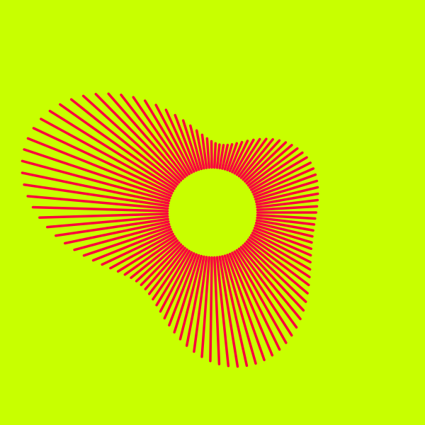

This is a "study" in which I try to disassemble and recreate designs that other artists have created. It is a way to learn, and hopefully stumble on something interesting along the way.

This study was inspired by this image.

## Elements to observe and recreate
1. Notice the circluar "gap" in the center
2. There are 'radial lines' emanating from the circle and going out.
3. The lengths of the radials are what make the shapes interesting. 
    a. The lengths could be Perlin Noise, dependent on the neighboring length.
    b. The lengths could be sinusoidal, but with the amplitude of the sine waves changing.
4. For better aesthetics, make sure that the final radial and the first radial spoke are close in height to each other. Maybe even the same.
5. The radial lines have rounded endcaps.

## Coding Sub-tasks
1. Draw `n` points on a cirle of radius `r`
2. Draw n radials from the cirle of length `r + random(delta_r)`
3. Draw a Sinusoidal (Sine/cosine) pattern with `n` vertical lines.
4. Vary the amplitude of the sine/cosine
5. Put it all together

### Notes on making the Radial heights to be Sinusoidal

* r * sin(theta) will scale the sine values by r.
* base + r sin(theta) will ensure that the value is at least (base - r)
* The tricky part is that where the radials start and end, the sine values should be the same.
* Let's say that we start at some value x. y = height = Sin(x). Where all is y *also* equal to sin(x)? THat
will be in x, PI-x, x+2PI, 3PI-x, x+4PI, 5PI-x and so on..

Let's use the notation that 2PI is one 'octave'. So [x, PI-x] is within one octave.
[x, x+2PI] is exactly one ocatve. We use this fact in the code.

